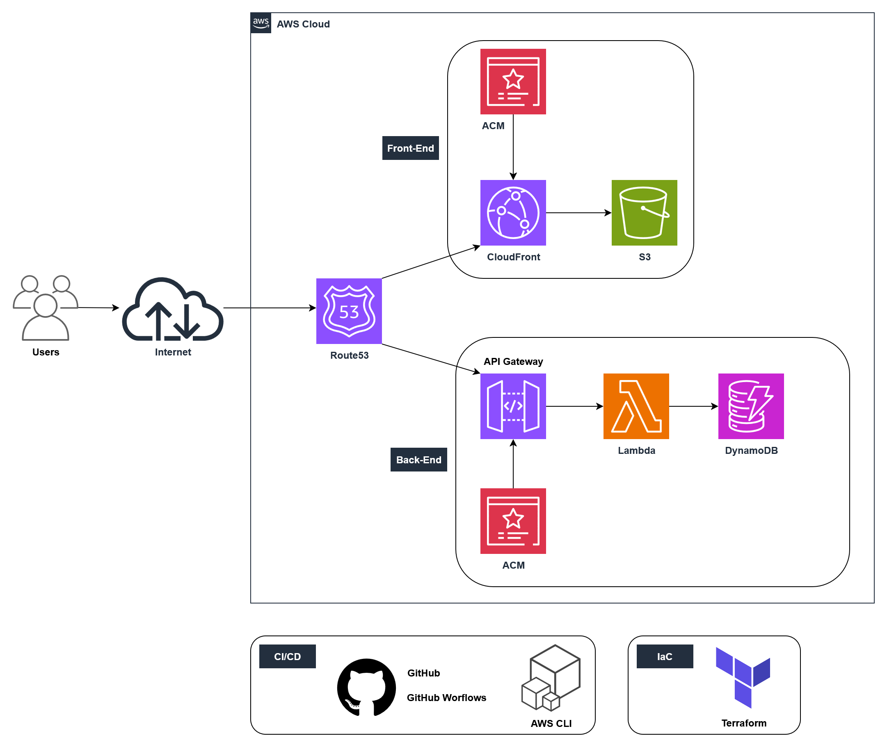

# ☁️ Cloud Resume Challenge

This is my completed implementation of the [Cloud Resume Challenge](https://cloudresumechallenge.dev/).  
It demonstrates cloud engineering, Infrastructure as Code (IaC), CI/CD, and serverless application design.

---

## 🌐 Live Site
🔗 [My Cloud Resume](https://tien-cloud.com)

---

## 🏗️ Architecture

- **Amazon S3** – Hosts the static website  
- **Amazon CloudFront** – Global CDN distribution + HTTPS  
- **AWS Certificate Manager (ACM)** – SSL/TLS certificates for HTTPS  
- **Amazon Route 53** – Domain name + DNS routing  
- **AWS DynamoDB** – Stores website visitor counter  
- **AWS Lambda (Python)** – Function to update DynamoDB  
- **Amazon API Gateway** – Connects frontend to Lambda securely  
- **GitHub Actions** – CI/CD pipeline for automatic deployments  
- **Terraform** – Modular Infrastructure as Code  


---

## 📂 Repository Structure

```bash
cloud-resume/
│── infra/                # Infrastructure-as-Code (Terraform)
│   ├── modules/          # Individual AWS service modules
│   └── environments/
│       └── prod/         # Production environment
│
│── website/              # Static frontend (HTML, CSS, JS)
│── .github/workflows/    # GitHub Actions CI/CD pipelines
│── README.md             # Project documentation

